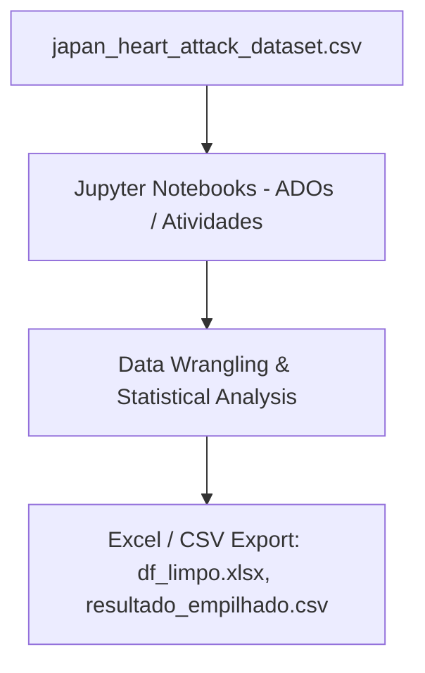

# Statistics & Probability Lab

[](https://jupyter.org/)
[](https://www.microsoft.com/excel)
[](https://www.python.org/)

## Table of Contents

- [Context](#-context)
- [Software features](#-software-features)
- [Technologies and tools](#-technologies-and-tools)
- [Architecture](#-architecture)
- [Repository structure](#-repository-structure)
- [Requirements](#-requirements)
- [How to run](#-how-to-run)
- [Author](#-author)

# 📌 Context

This repository is dedicated to documenting laboratory coursework, activities, and assignments (ADOs) for the Statistics and Probability course. It contains data analysis notebooks performing statistical calculations, probability distributions, data cleaning, and data visualization.

## 🚀 Software features

- **Base Structure Configured:** Structured organization of lessons, activities, and evaluation assignments.
- **Modular Data Analysis:** Segmented Jupyter Notebooks for data preparation, cleaning, statistics computation, and visual plotting.
- **Statistical Export:** Cleaned data and statistical results exported to Excel (`.xlsx`) and CSV formats.

## 🛠️ Technologies and tools

- Python 3
- Jupyter Notebook
- Pandas / NumPy
- Matplotlib / Seaborn
- Microsoft Excel

## 📋 Architecture



## 📂 Repository structure

```text
- 📂 lab_estatistica_e_probabilidade/
  - 📄 requirements.txt (Python packages lists)
  - 📂 ADOs/ (Course assignments)
    - 📂 ADO2/ (ADO 2 notebooks and data)
      - 📄 ADO2.ipynb
      - 📄 df_limpo.xlsx
      - 📄 resultado_empilhado.csv
    - 📂 ADO3/ / ADO4/ / ADO5/
  - 📂 Atividades/ (Classroom exercises)
    - 📂 Atividade01/ / Atividade02/
      - 📄 japan_heart_attack_dataset.csv (Dataset)
  - 📂 Aulas/ (Lecture scripts and exercises)
```

## 📦 Requirements

- Python 3.10+
- Microsoft Excel (to open spreadsheet outputs)
- Jupyter Notebook environment

## ⚙️ How to run

### 1. Clone the Repository
Clone the repository to your local machine:
```bash
git clone https://github.com/MatheusRodri/lab_estatistica_e_probabilidade.git
cd lab_estatistica_e_probabilidade
```

### 2. Set Up a Virtual Environment (Optional but Recommended)
Create and activate a virtual environment:

**On Windows (PowerShell):**
```powershell
python -m venv venv
.\venv\Scripts\Activate.ps1
```

**On Windows (Command Prompt):**
```cmd
python -m venv venv
.\venv\Scripts\activate.bat
```

**On Linux/macOS:**
```bash
python3 -m venv venv
source venv/bin/activate
```

### 3. Install Dependencies
Install the required libraries listed in `requirements.txt`:
```bash
pip install -r requirements.txt
```

### 4. Run the Project
1. Start Jupyter Notebook:
   ```bash
   jupyter notebook
   ```
2. Open any `.ipynb` file inside `ADOs/` or `Atividades/` folders in the browser dashboard.
3. Run the cells to view the statistical calculations, distributions, and graphs.

## 👤 Author

Matheus Rodrigues 
[LinkedIn](https://linkedin.com/in/matheus-rodrigues-mrj) [GitHub](https://github.com/MatheusRodri)
